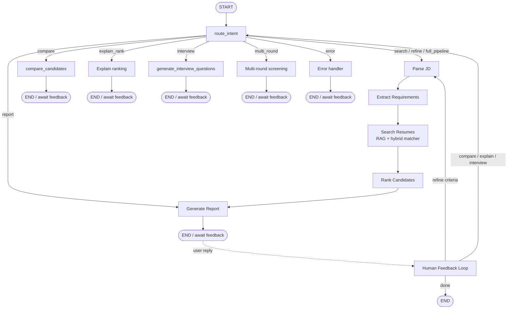

# State Machine Diagram — Matching Agent

## LangGraph workflow

## Agent state (tracked fields)

| Field | Purpose |
|-------|---------|
| `messages` | Conversation history |
| `jd_text` / `jd_title` | Job understanding |
| `requirements` | Must-have vs nice-to-have |
| `shortlist` / `reasoning` | Ranked candidates + trail |
| `refined_criteria` | Mid-conversation adjustments |
| `ranking_changes` | Explain re-rank deltas |
| `round1/2/3` artifacts | Multi-round screening |
| `awaiting_feedback` | Human-in-the-loop flag |

## Happy path (assignment wording)

**START → Parse JD → Extract Requirements → Search Resumes → Rank Candidates → Generate Report → Human Feedback Loop → END**
